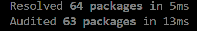

# PAC-Comp

A repository that houses my comp experiment that is based on the pac website and stats

---

## Description of Project

For this project, I am creating a scraping tool that collects its data directly from the PAC website. This makes the stats more accessible and easier to find. Initially, the project focuses on baseball, but it will be expanded to other sports later.  

The reason for this experiment is to address the difficulty of finding PAC stats in one place. The final outcome will be a tool that automatically collects stats from the PAC website and stores them in a database, making data access and discoverability much easier.  

By organizing all PAC stats into a single dataset, this project creates opportunities for analysis, comparison, and visualization. Coaches, players, and researchers can more easily track performance over multiple years, identify trends, and make data-driven decisions.

---

## Tools

- BeautifulSoup  
- Python  
- Selenium  
- Pandas  
- SQLAlchemy  
- Matplotlib  
- Streamlit  
- plotly>=6.3.1
- webdriver-manager>=4.0

---
## Notice

Everything can be run from VS Code terminal

## Steps to Run

### 1. Make sure UV is installed, after run :

```
uv init
```

### 2. Install Dependencies

After running the command  ```uv init```  it should have created a .toml file and within this file holds the dependencies to run my tool. Then you need to add those to a virtual enviroment (.venv) ; do so my typing the command below :

```
uv sync
```

After running you should encounter something like this :



### 3. Run Website/player search engine:

Make your way to src folder using ```cd src``` following that run :

```
streamlit run Seekr.py
```

### Success

You will know you have done everything correct, if after running the previous command you be automatically pulled to the browser at which streamlit is hosting your project.

#### Note

If you run the grabber locally using  ```uv run grabber.py``` you will be met with a few to many csv files then you would want. Thus I created a clean file that takes 5 second to clean csv files. To run cleaner just run  ```uv run clean.py.

##### Issue

Please leave any issues in the issue tracker or send me an email at Hopkins02@allegheny.edu


